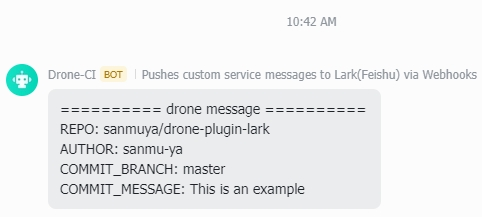

## drone-plugin-lark
[]()
[]()
[]()

drone Lark - Custom group chat robot message push plugin.

Read this in other languages: [English](README.md)，[简体中文](README-ZH.md)。

## Environment

- `PLUGIN_WEBHOOK`: This is a required parameter for the webhook of the lark group chat robot
- `PLUGIN_SECRET`: This is a required parameter, please turn on the lark group chat robot signature verification
- `PLUGIN_MESSAGE`: Here is the text content to be sent, you can fill in multiple lines of text as the example, the effect can refer to the picture below. The lines are separated by `,`

## How to use

- Run the docker image directly from the terminal

  ```shell
  docker run --rm \
  -e PLUGIN_WEBHOOK="https://open.feishu.cn/open-apis/bot/v2/hook/f1ac0a3e-4555-420f-99a9-338cf39600f2" \
  -e PLUGIN_SECRET="tsOjqrp6RGazcs9QaFmhj" \
  -e PLUGIN_MESSAGE="========== drone message ==========,REPO: sanmu-ya/drone-plugin-lark,AUTHOR: sanmu-ya,COMMIT_BRANCH: master,COMMIT_MESSAGE: This is an example" \
  sanmuya/drone-plugin-lark
  ```

- Add a step to your .drone.yml
  ```yml
  steps:
  - name: lark
    image: sanmuya/drone-plugin-lark:latest
    settings:
      webhook: https://open.feishu.cn/open-apis/bot/v2/hook/f1ac0a3e-4555-420f-99a9-338cf39600f2
      secret:
        from_secret: lark-secret
      message:
        - ========== drone message ==========
        - REPO: ${DRONE_REPO}
        - AUTHOR: ${DRONE_COMMIT_AUTHOR_NAME}
        - COMMIT_BRANCH: ${DRONE_COMMIT_BRANCH}
        - COMMIT_MESSAGE: ${DRONE_COMMIT_MESSAGE}
  ```

## Result

